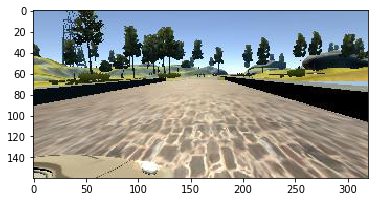
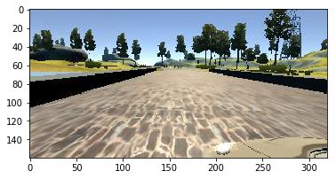
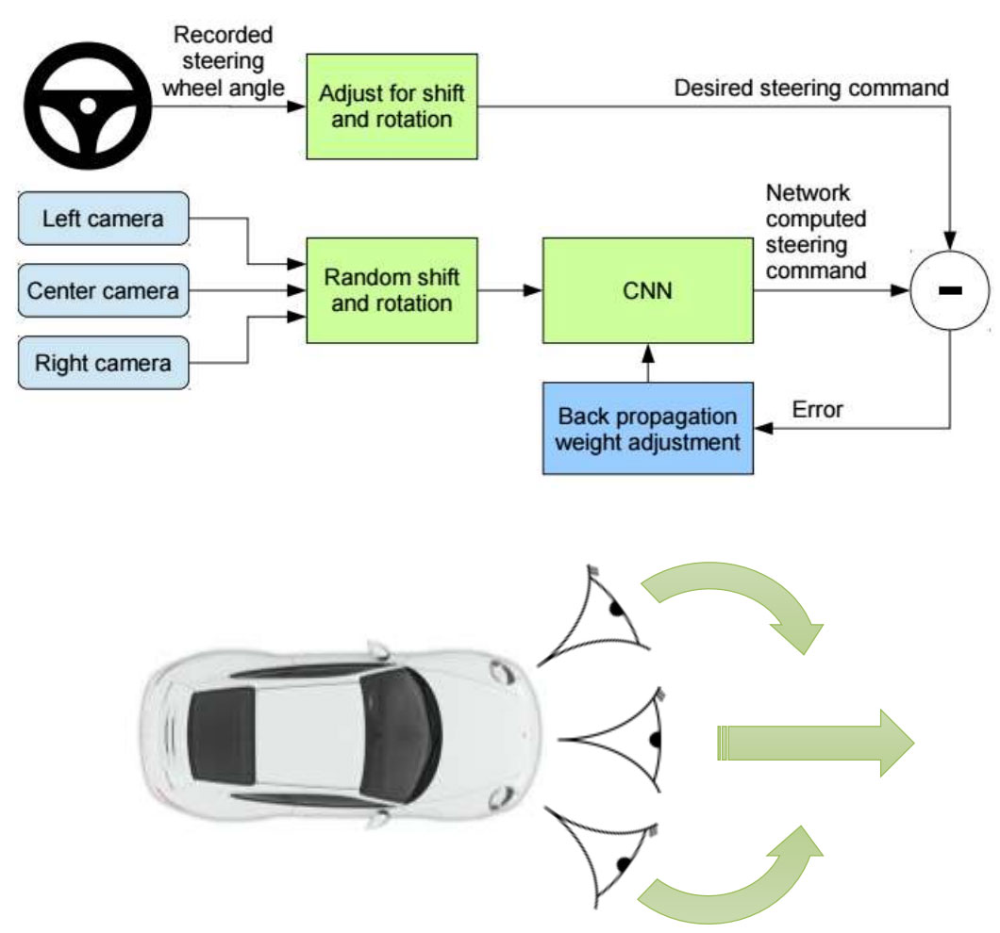
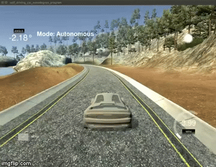

# Behavioral Cloning End to End Deep Learning Project


Overview
---
**This project is my implementation of NVIDIA's PilotNet End to End deep CNN (built with [Keras](https://keras.io/)) to clone the behavior of a self driving car .**

**The dataset used to train the network is generated from [Udacity's Self-Driving Car Simulator](https://github.com/udacity/self-driving-car-sim), and it consists of images taken from three different camera angles (Center - Left - Right), in addition to the steering angle, throttle, brake, and speed during each frame.**

**The network is based on NVIDIA's paper [End to End Learning for Self-Driving Cars](https://arxiv.org/pdf/1604.07316v1.pdf).**


## Pipeline 
- **Data Loading.**
- **Data Augmentation.**
- **Data Preprocessing.**
- **Model Architecture.**
- **Model Training and Evaluation.**
- **Model Testing on the simulator.**

## Files included
This repository consists: 
* `model.py` (script used to create and train the model)
* `drive.py` (script to drive the car )
* `model.h5` (a trained Keras model)


### Local Workstation Environment:
-  Ubuntu 16.04
-  Python 3.5.2
-  Keras 2.1.6
-  TensorFlow-gpu 1.10.1
-  GPU: NVIDIA GeForce GTX 1050

### Dependencies

* `tensorflow-gpu`
* `Keras`
* `socketio`
* `eventlet`
* `h5py`
* `pandas`
* `numpy`
* `OpenCV`
---

## Run Instructions

```bash
sudo pip install -r requirements.txt
git clone https://github.com/abhileshborode/Behavorial-Clonng-Self-driving-cars.git
cd Behavorial-Clonng-Self-driving-cars
python model.py
python drive.py model.h5 run1
python video.py run1
python video.py run1 --fps 48 (optional to change the fps)
```
---
## Data Loading

Download the dataset from [here](https://d17h27t6h515a5.cloudfront.net/topher/2016/December/584f6edd_data/data.zip).
This dataset contains more images taken from the 3 cameras center left and right  (3 images for each frame), in addition to a `drive_log.csv` file with the steering angle, throttle, brake, and speed during each frame.

<figure>
 
 <figcaption>
 <p></p> 
 </figcaption>
</figure>

---
## Data Preprocessing

-  Cropping the image to cut off the sky scene and the car front.
-  Resizing the image to (66 * 200), the image size expected by the model.
-  Normalizing the images (by dividing image data by 127.5 and subtracting 1.0). As stated in the Model Architecture , this is to avoid saturation and make gradients work better).

### Augmentation steps

-  Flipping images horizontaly, with steering angle adjustment (This has the eqivalent effect as driving the same track in the opposite direction)


**Image flipping**:
<figure>
 
 <figcaption>
 <p></p> 
 </figcaption>
</figure>

<figure>
 
 <figcaption>
 <p></p> 
 </figcaption>
</figure>

Although `model.py` file consists of code for data augmentation I decided not to use it to save memory as the data from the 3 front cameras was sufficent to drive the car within the lane boundaries.
## Model Architecture


I used a convolutional neural network (CNN) to map pixels from three cameras mounted along the left,right and the center of the car directly to steering angle positions.

I used the ConvNet from NVIDIA's paper [End to End Learning for Self-Driving Cars](https://arxiv.org/pdf/1604.07316v1.pdf) (Image Courtesy: NVIDIA)

<figure>
 
 <figcaption>
 <p></p>
 </figcaption>
</figure>


<figure>
 
 <figcaption>
 <p></p>
 </figcaption>
</figure>

A dropout layer is added after the flattening layer to prevent overfitting.
---
## Model Training and Evaluation

-  I've split the data into 80% training set and 20% validation set to measure the performance after each epoch.
-  I used Mean Squared Error (MSE) as a loss function to measure how close the model predicts to the given steering angle for each input frame.
-  I used the Adaptive Moment Estimation (Adam) Algorithm minimize to the loss function. 

### Model Training:

| Layer (type)                   |Output Shape      |Params  |Connected to     |
|--------------------------------|------------------|-------:|-----------------|
|cropping2d_1 (Cropping2d)       |(None, 90, 320, 3)|0       |cropping2d_input1|
|lambda_1 (Lambda)               |(None, 200, 66, 3)|0       |croupping2d_1    |
|lambda_2 (Lambda)               |(None, 200, 66, 3)|0       |lambda_1         |
|convolution2d_1 (Convolution2D) |(None, 98, 31, 24)|1824    |lambda_2         |
|convolution2d_2 (Convolution2D) |(None, 47, 14, 36)|21636   |convolution2d_1  |
|convolution2d_3 (Convolution2D) |(None, 22, 5, 48) |43248   |convolution2d_2  |
|convolution2d_4 (Convolution2D) |(None, 20, 3, 64) |27712   |convolution2d_3  |
|convolution2d_5 (Convolution2D) |(None, 18, 1, 64) |36928   |convolution2d_4  |
|dropout_1 (Dropout)             |(None, 18, 1, 64) |0       |convolution2d_5  |
|flatten_1 (Flatten)             |(None, 1152)      |0       |dropout_1        |
|dense_1 (Dense)                 |(None, 100)       |115300  |flatten_1        |
|dense_2 (Dense)                 |(None, 50)        |5050    |dense_1          |
|dense_3 (Dense)                 |(None, 10)        |510     |dense_2          |
|dense_4 (Dense)                 |(None, 1)         |11      |dense_3          |
|                                |**Total params**  |252,219 |                 |

## Model Evaluation:

| Epoch         |Loss       |Validation Loss  |
|---------------|-----------|-----------------|
|1/6           |0.0200     |0.0184            |
|2/6           |0.0158     |0.0170            |
|3/6           |0.0138     |0.0205            |
|4/6           |0.0120     |0.0210            |
|5/6           |0.0108     |0.0200            |
|6/6           |0.0097     |0.0193            |

---

## Results
[](https://www.youtube.com/watch?v=hlVunHZUroE&t=4s)

---
## Conclusion

Using NVIDIA's End to End learning network, the model was able to drive the car through the first track. I've used the training data provided by Udacity. Possible ways to improve the model is to get more driving data in different tracks so as to generalise the model. We can include more features from the `drive_log.csv` file such as throttle, speed, brake so that the car can drive faster in a straight lane and apply brakes to reduce the speed around sharp curves. More powerfull architectues could also be used like VGG-16,mobilenet.

## Similar Work with different methods

* https://arxiv.org/abs/1708.03798
* https://github.com/commaai/research/blob/master/train_steering_model.py
* https://github.com/viadanna/sdc-behaviour-cloning


